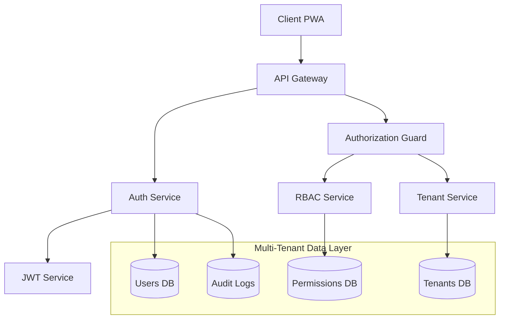
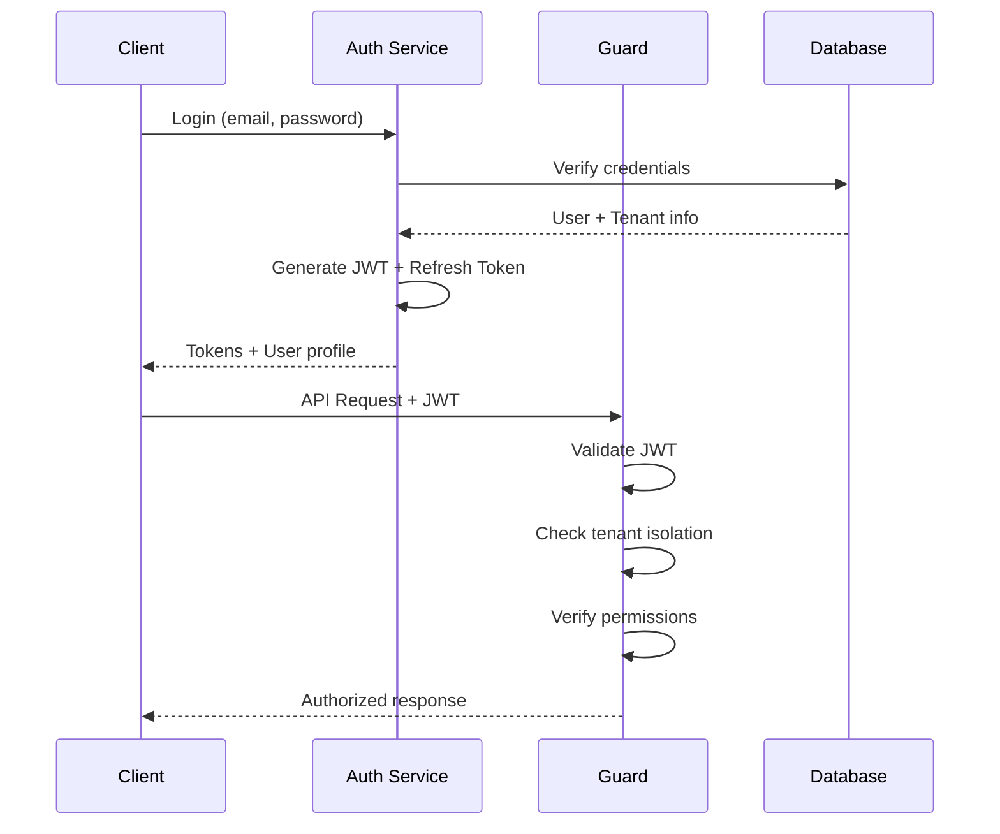

# Design Document - Système d'Authentification et Multi-Tenant

## Overview

Le système d'authentification et multi-tenant constitue la couche de sécurité fondamentale du système de gestion CROU. Il implémente une architecture JWT avec refresh tokens, un système RBAC granulaire, et une isolation stricte des données par tenant. La conception privilégie la sécurité, la performance et la scalabilité pour supporter les 8 CROU et le Ministère avec leurs utilisateurs respectifs.

## Architecture

### Architecture Globale



### Architecture de Sécurité



## Components and Interfaces

### 1. Authentication Service

**Responsabilités:**
- Gestion des connexions/déconnexions
- Génération et validation des tokens JWT
- Gestion des refresh tokens
- Hashage sécurisé des mots de passe

**Interface:**
```typescript
interface AuthService {
  login(credentials: LoginCredentials): Promise<AuthResult>
  logout(token: string): Promise<void>
  refreshToken(refreshToken: string): Promise<AuthResult>
  validateToken(token: string): Promise<TokenPayload>
  changePassword(userId: string, oldPassword: string, newPassword: string): Promise<void>
}

interface LoginCredentials {
  email: string
  password: string
}

interface AuthResult {
  accessToken: string
  refreshToken: string
  user: UserProfile
  expiresIn: number
}

interface TokenPayload {
  userId: string
  tenantId: string
  role: string
  permissions: string[]
  iat: number
  exp: number
}
```

### 2. Multi-Tenant Service

**Responsabilités:**
- Gestion des tenants (Ministère + 8 CROU)
- Isolation des données par tenant
- Configuration des tenants

**Interface:**
```typescript
interface TenantService {
  getTenant(tenantId: string): Promise<Tenant>
  getUserTenant(userId: string): Promise<Tenant>
  validateTenantAccess(userId: string, resourceTenantId: string): Promise<boolean>
  listTenants(): Promise<Tenant[]>
}

interface Tenant {
  id: string
  name: string
  type: 'ministere' | 'crou'
  config: TenantConfig
  isActive: boolean
  createdAt: Date
}

interface TenantConfig {
  allowedModules: string[]
  customSettings: Record<string, any>
  dataRetentionDays: number
}
```

### 3. RBAC Service

**Responsabilités:**
- Gestion des rôles et permissions
- Vérification des autorisations
- Matrice de permissions dynamique

**Interface:**
```typescript
interface RBACService {
  getUserPermissions(userId: string): Promise<Permission[]>
  checkPermission(userId: string, resource: string, action: string): Promise<boolean>
  assignRole(userId: string, roleId: string): Promise<void>
  createRole(role: CreateRoleDto): Promise<Role>
}

interface Permission {
  id: string
  resource: string // 'dashboard', 'finances', 'stocks', etc.
  actions: PermissionAction[] // ['read', 'write', 'validate']
  conditions?: PermissionCondition[]
}

interface Role {
  id: string
  name: string
  tenantType: 'ministere' | 'crou' | 'both'
  permissions: Permission[]
  isSystemRole: boolean
}

type PermissionAction = 'read' | 'write' | 'validate' | 'delete' | 'export'

interface PermissionCondition {
  field: string
  operator: 'eq' | 'in' | 'gt' | 'lt'
  value: any
}
```

### 4. Authorization Guard

**Responsabilités:**
- Middleware d'autorisation pour toutes les routes
- Validation des tokens JWT
- Application des règles RBAC et multi-tenant

**Interface:**
```typescript
interface AuthorizationGuard {
  canActivate(context: ExecutionContext): Promise<boolean>
  validateRequest(request: AuthenticatedRequest): Promise<void>
}

interface AuthenticatedRequest extends Request {
  user: {
    id: string
    tenantId: string
    role: string
    permissions: Permission[]
  }
}
```

### 5. Audit Service

**Responsabilités:**
- Enregistrement des événements de sécurité
- Traçabilité des actions utilisateurs
- Détection d'activités suspectes

**Interface:**
```typescript
interface AuditService {
  logAuthEvent(event: AuthEvent): Promise<void>
  logAccessEvent(event: AccessEvent): Promise<void>
  logSecurityEvent(event: SecurityEvent): Promise<void>
  getAuditLogs(filters: AuditFilters): Promise<AuditLog[]>
}

interface AuditEvent {
  type: 'login' | 'logout' | 'token_refresh' | 'password_change'
  userId?: string
  tenantId?: string
  ipAddress: string
  userAgent: string
  success: boolean
  details?: Record<string, any>
}

interface AccessEvent {
  userId: string
  tenantId: string
  resource: string
  action: string
  success: boolean
  ipAddress: string
  timestamp: Date
}
```

## Data Models

### Base de Données Multi-Tenant

```sql
-- Table des tenants
CREATE TABLE tenants (
  id VARCHAR(50) PRIMARY KEY,
  name VARCHAR(255) NOT NULL,
  type ENUM('ministere', 'crou') NOT NULL,
  config JSON,
  is_active BOOLEAN DEFAULT true,
  created_at TIMESTAMP DEFAULT CURRENT_TIMESTAMP,
  updated_at TIMESTAMP DEFAULT CURRENT_TIMESTAMP ON UPDATE CURRENT_TIMESTAMP
);

-- Table des utilisateurs
CREATE TABLE users (
  id UUID PRIMARY KEY DEFAULT gen_random_uuid(),
  tenant_id VARCHAR(50) NOT NULL,
  email VARCHAR(255) UNIQUE NOT NULL,
  password_hash VARCHAR(255) NOT NULL,
  first_name VARCHAR(100) NOT NULL,
  last_name VARCHAR(100) NOT NULL,
  role_id UUID NOT NULL,
  is_active BOOLEAN DEFAULT true,
  must_change_password BOOLEAN DEFAULT false,
  last_login TIMESTAMP,
  failed_login_attempts INT DEFAULT 0,
  locked_until TIMESTAMP NULL,
  created_at TIMESTAMP DEFAULT CURRENT_TIMESTAMP,
  updated_at TIMESTAMP DEFAULT CURRENT_TIMESTAMP ON UPDATE CURRENT_TIMESTAMP,
  FOREIGN KEY (tenant_id) REFERENCES tenants(id),
  FOREIGN KEY (role_id) REFERENCES roles(id)
);

-- Table des rôles
CREATE TABLE roles (
  id UUID PRIMARY KEY DEFAULT gen_random_uuid(),
  name VARCHAR(100) NOT NULL,
  tenant_type ENUM('ministere', 'crou', 'both') NOT NULL,
  is_system_role BOOLEAN DEFAULT false,
  created_at TIMESTAMP DEFAULT CURRENT_TIMESTAMP
);

-- Table des permissions
CREATE TABLE permissions (
  id UUID PRIMARY KEY DEFAULT gen_random_uuid(),
  resource VARCHAR(50) NOT NULL,
  actions JSON NOT NULL, -- ['read', 'write', 'validate']
  conditions JSON NULL,
  created_at TIMESTAMP DEFAULT CURRENT_TIMESTAMP
);

-- Table de liaison rôles-permissions
CREATE TABLE role_permissions (
  role_id UUID NOT NULL,
  permission_id UUID NOT NULL,
  PRIMARY KEY (role_id, permission_id),
  FOREIGN KEY (role_id) REFERENCES roles(id) ON DELETE CASCADE,
  FOREIGN KEY (permission_id) REFERENCES permissions(id) ON DELETE CASCADE
);

-- Table des refresh tokens
CREATE TABLE refresh_tokens (
  id UUID PRIMARY KEY DEFAULT gen_random_uuid(),
  user_id UUID NOT NULL,
  token_hash VARCHAR(255) NOT NULL,
  expires_at TIMESTAMP NOT NULL,
  is_revoked BOOLEAN DEFAULT false,
  created_at TIMESTAMP DEFAULT CURRENT_TIMESTAMP,
  FOREIGN KEY (user_id) REFERENCES users(id) ON DELETE CASCADE
);

-- Table des logs d'audit
CREATE TABLE audit_logs (
  id UUID PRIMARY KEY DEFAULT gen_random_uuid(),
  user_id UUID NULL,
  tenant_id VARCHAR(50) NULL,
  event_type VARCHAR(50) NOT NULL,
  resource VARCHAR(100) NULL,
  action VARCHAR(50) NULL,
  ip_address INET NOT NULL,
  user_agent TEXT,
  success BOOLEAN NOT NULL,
  details JSON NULL,
  created_at TIMESTAMP DEFAULT CURRENT_TIMESTAMP,
  FOREIGN KEY (user_id) REFERENCES users(id),
  FOREIGN KEY (tenant_id) REFERENCES tenants(id)
);
```

### Données de Référence

```sql
-- Tenants par défaut
INSERT INTO tenants (id, name, type) VALUES
('ministere', 'Ministère de l''Enseignement Supérieur', 'ministere'),
('crou_niamey', 'CROU Niamey', 'crou'),
('crou_dosso', 'CROU Dosso', 'crou'),
('crou_maradi', 'CROU Maradi', 'crou'),
('crou_tahoua', 'CROU Tahoua', 'crou'),
('crou_zinder', 'CROU Zinder', 'crou'),
('crou_agadez', 'CROU Agadez', 'crou'),
('crou_diffa', 'CROU Diffa', 'crou'),
('crou_tillaberi', 'CROU Tillabéri', 'crou');

-- Rôles système
INSERT INTO roles (name, tenant_type, is_system_role) VALUES
('Ministre', 'ministere', true),
('Directeur Affaires Financières', 'ministere', true),
('Responsable Approvisionnements', 'ministere', true),
('Contrôleur Budgétaire', 'ministere', true),
('Directeur CROU', 'crou', true),
('Secrétaire Administratif', 'crou', true),
('Chef Financier', 'crou', true),
('Comptable', 'crou', true);
```

## Error Handling

### Stratégie de Gestion d'Erreurs

```typescript
// Erreurs d'authentification
export class AuthenticationError extends Error {
  constructor(message: string, public code: string) {
    super(message)
    this.name = 'AuthenticationError'
  }
}

// Erreurs d'autorisation
export class AuthorizationError extends Error {
  constructor(message: string, public requiredPermission: string) {
    super(message)
    this.name = 'AuthorizationError'
  }
}

// Erreurs multi-tenant
export class TenantError extends Error {
  constructor(message: string, public tenantId: string) {
    super(message)
    this.name = 'TenantError'
  }
}

// Middleware de gestion d'erreurs
export const errorHandler = (error: Error, req: Request, res: Response, next: NextFunction) => {
  if (error instanceof AuthenticationError) {
    return res.status(401).json({
      error: 'Authentication failed',
      code: error.code,
      message: 'Invalid credentials'
    })
  }
  
  if (error instanceof AuthorizationError) {
    return res.status(403).json({
      error: 'Access denied',
      message: 'Insufficient permissions',
      requiredPermission: error.requiredPermission
    })
  }
  
  if (error instanceof TenantError) {
    return res.status(403).json({
      error: 'Tenant access denied',
      message: 'Access to this tenant is not allowed'
    })
  }
  
  // Erreur générique
  res.status(500).json({
    error: 'Internal server error',
    message: 'An unexpected error occurred'
  })
}
```

### Codes d'Erreur Standardisés

```typescript
export const AUTH_ERROR_CODES = {
  INVALID_CREDENTIALS: 'AUTH_001',
  ACCOUNT_LOCKED: 'AUTH_002',
  TOKEN_EXPIRED: 'AUTH_003',
  TOKEN_INVALID: 'AUTH_004',
  REFRESH_TOKEN_EXPIRED: 'AUTH_005',
  PASSWORD_POLICY_VIOLATION: 'AUTH_006',
  ACCOUNT_DISABLED: 'AUTH_007',
  TENANT_DISABLED: 'AUTH_008',
  INSUFFICIENT_PERMISSIONS: 'AUTH_009',
  TENANT_ACCESS_DENIED: 'AUTH_010'
} as const
```

## Testing Strategy

### Tests Unitaires

```typescript
// Tests du service d'authentification
describe('AuthService', () => {
  describe('login', () => {
    it('should return tokens for valid credentials', async () => {
      const result = await authService.login({
        email: 'user@crou.ne',
        password: 'validPassword'
      })
      
      expect(result.accessToken).toBeDefined()
      expect(result.refreshToken).toBeDefined()
      expect(result.user.tenantId).toBe('crou_niamey')
    })
    
    it('should throw error for invalid credentials', async () => {
      await expect(authService.login({
        email: 'user@crou.ne',
        password: 'wrongPassword'
      })).rejects.toThrow(AuthenticationError)
    })
    
    it('should lock account after 5 failed attempts', async () => {
      // Simulate 5 failed login attempts
      for (let i = 0; i < 5; i++) {
        await expect(authService.login({
          email: 'user@crou.ne',
          password: 'wrongPassword'
        })).rejects.toThrow()
      }
      
      // 6th attempt should indicate account is locked
      await expect(authService.login({
        email: 'user@crou.ne',
        password: 'wrongPassword'
      })).rejects.toThrow('Account is temporarily locked')
    })
  })
})

// Tests du service multi-tenant
describe('TenantService', () => {
  it('should isolate data by tenant', async () => {
    const crouUser = { tenantId: 'crou_niamey' }
    const ministereUser = { tenantId: 'ministere' }
    
    const canAccessOwnData = await tenantService.validateTenantAccess(
      crouUser.tenantId, 
      'crou_niamey'
    )
    expect(canAccessOwnData).toBe(true)
    
    const canAccessOtherCrou = await tenantService.validateTenantAccess(
      crouUser.tenantId, 
      'crou_dosso'
    )
    expect(canAccessOtherCrou).toBe(false)
    
    const ministereCanAccessAll = await tenantService.validateTenantAccess(
      ministereUser.tenantId, 
      'crou_niamey'
    )
    expect(ministereCanAccessAll).toBe(true)
  })
})
```

### Tests d'Intégration

```typescript
describe('Authentication Integration', () => {
  it('should complete full authentication flow', async () => {
    // Login
    const loginResponse = await request(app)
      .post('/api/auth/login')
      .send({
        email: 'directeur@crou-niamey.ne',
        password: 'testPassword'
      })
      .expect(200)
    
    const { accessToken, refreshToken } = loginResponse.body
    
    // Access protected resource
    const protectedResponse = await request(app)
      .get('/api/dashboard')
      .set('Authorization', `Bearer ${accessToken}`)
      .expect(200)
    
    expect(protectedResponse.body.tenantId).toBe('crou_niamey')
    
    // Refresh token
    const refreshResponse = await request(app)
      .post('/api/auth/refresh')
      .send({ refreshToken })
      .expect(200)
    
    expect(refreshResponse.body.accessToken).toBeDefined()
  })
})
```

### Tests de Sécurité

```typescript
describe('Security Tests', () => {
  it('should prevent SQL injection in login', async () => {
    await request(app)
      .post('/api/auth/login')
      .send({
        email: "'; DROP TABLE users; --",
        password: 'password'
      })
      .expect(401)
    
    // Verify users table still exists
    const users = await userRepository.find()
    expect(users).toBeDefined()
  })
  
  it('should enforce rate limiting', async () => {
    const requests = Array(101).fill(null).map(() =>
      request(app)
        .post('/api/auth/login')
        .send({ email: 'test@test.com', password: 'wrong' })
    )
    
    const responses = await Promise.all(requests)
    const rateLimitedResponses = responses.filter(r => r.status === 429)
    
    expect(rateLimitedResponses.length).toBeGreaterThan(0)
  })
})
```

## Performance Considerations

### Optimisations JWT

- **Token Size**: Minimiser la taille des tokens JWT en incluant seulement les données essentielles
- **Caching**: Cache Redis pour les tokens validés (TTL = durée de vie du token)
- **Refresh Strategy**: Rotation automatique des refresh tokens pour sécurité maximale

### Optimisations Base de Données

- **Indexation**: Index sur `users.email`, `users.tenant_id`, `audit_logs.created_at`
- **Partitioning**: Partitionnement des logs d'audit par mois
- **Connection Pooling**: Pool de connexions optimisé pour la charge

### Monitoring et Métriques

```typescript
// Métriques de performance
export const authMetrics = {
  loginAttempts: new Counter('auth_login_attempts_total'),
  loginDuration: new Histogram('auth_login_duration_seconds'),
  tokenValidations: new Counter('auth_token_validations_total'),
  failedAuthorizations: new Counter('auth_authorization_failures_total')
}
```

Cette conception fournit une base solide et sécurisée pour le système d'authentification et multi-tenant, respectant les exigences du PRD tout en maintenant la flexibilité nécessaire pour les évolutions futures.