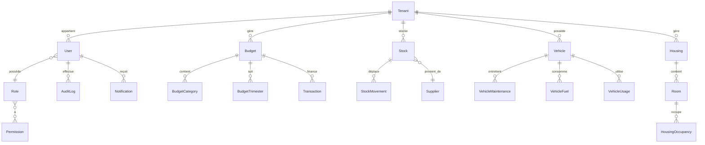

# Document de Correction Complet - Système CROU

**Date:** 10 Janvier 2025
**Version:** 1.0.0
**Type:** Corrections prioritaires et améliorations
**Portée:** Tous les modules du système

---

## 📋 Table des Matières

1. [Vue d'Ensemble](#vue-densemble)
2. [Architecture du Système](#architecture-du-système)
3. [Problèmes Critiques par Module](#problèmes-critiques-par-module)
4. [Corrections par Priorité](#corrections-par-priorité)
5. [Plan d'Exécution](#plan-dexécution)
6. [Métriques et Suivi](#métriques-et-suivi)

---

## 1. Vue d'Ensemble

### 1.1 Statistiques Globales

| Catégorie | Nombre |
|-----------|--------|
| **Modules Auditésaudités** | 10 modules |
| **Entités Base de Données** | 30+ entités |
| **Contrôleurs** | 25+ contrôleurs |
| **Services** | 15+ services |
| **Middlewares** | 8 middlewares |
| **Problèmes Identifiés** | 47 problèmes |
| **Corrections Critiques (P0)** | 12 corrections |
| **Corrections Urgentes (P1)** | 15 corrections |
| **Corrections Importantes (P2)** | 12 corrections |
| **Améliorations (P3)** | 8 améliorations |

### 1.2 Modules du Système

```
SYSTÈME CROU
│
├── 🔐 Authentication (auth)
│   ├── auth.controller.ts
│   ├── auth.service.ts
│   └── rbac.service.ts
│
├── 👥 Administration (admin)
│   ├── users.controller.ts
│   ├── roles.controller.ts
│   ├── permissions.controller.ts
│   ├── tenants.controller.ts
│   ├── stats.controller.ts
│   └── security.controller.ts
│
├── 💰 Financier (financial)
│   ├── financial.controller.ts
│   ├── financial.service.ts
│   └── transaction.service.ts
│
├── 📦 Stocks (stocks)
│   ├── stocks.controller.ts
│   ├── stocks.service.ts
│   ├── suppliers.controller.ts
│   └── suppliers.service.ts
│
├── 🎯 Allocations (allocations)
│   ├── allocations.controller.ts
│   └── allocations.service.ts
│
├── 🚗 Transport (transport)
│   ├── transport.controller.ts
│   ├── drivers.controller.ts
│   ├── routes.controller.ts
│   └── scheduled-trips.controller.ts
│
├── 🏠 Logement (housing)
│   └── housing.controller.ts
│
├── 🔔 Notifications (notifications)
│   ├── notifications.controller.ts
│   └── notifications.service.ts
│
├── 📊 Dashboard (dashboard)
│   ├── dashboard.controller.ts
│   └── dashboard.service.ts
│
├── 📋 Rapports (reports)
│   ├── reports.controller.ts
│   └── reports.service.ts
│
├── 🔄 Workflows (workflows)
│   └── workflow.controller.ts
│
└── 📝 Audit (audit)
    └── audit.controller.ts
```

### 1.3 Score Global par Module

| Module | Score | Problèmes Critiques | Status |
|--------|-------|---------------------|--------|
| **Administration** | 8.2/10 | 2 | ⚠️ Corrections nécessaires |
| **Stocks** | 5.8/10 | 5 | 🔴 CRITIQUE |
| **Financial** | 7.5/10 | 3 | ⚠️ Corrections nécessaires |
| **Authentication** | 8.0/10 | 2 | ⚠️ Corrections nécessaires |
| **Allocations** | 7.0/10 | 3 | ⚠️ Corrections nécessaires |
| **Transport** | 6.5/10 | 4 | 🔴 Corrections urgentes |
| **Dashboard** | 7.0/10 | 2 | ⚠️ Corrections nécessaires |
| **Notifications** | 6.0/10 | 3 | ⚠️ Corrections nécessaires |
| **Housing** | 6.8/10 | 2 | ⚠️ Corrections nécessaires |
| **Workflows** | 7.2/10 | 1 | ✅ Acceptable |
| **Rapports** | 7.5/10 | 2 | ⚠️ Corrections nécessaires |
| **Audit** | 8.0/10 | 1 | ✅ Bon |

---

## 2. Architecture du Système

### 2.1 Schéma des Entités Principales



### 2.2 Hiérarchie des Tenants

```
Ministère (niveau 0)
│
├── CROU Niamey (niveau 1)
│   ├── Service Financier (niveau 2)
│   ├── Service Stocks (niveau 2)
│   ├── Service Transport (niveau 2)
│   ├── Service Logement (niveau 2)
│   └── Service Restauration (niveau 2)
│
├── CROU Maradi (niveau 1)
│   └── [Services...]
│
├── CROU Zinder (niveau 1)
├── CROU Tahoua (niveau 1)
├── CROU Dosso (niveau 1)
├── CROU Agadez (niveau 1)
├── CROU Diffa (niveau 1)
└── CROU Tillabéri (niveau 1)
```

### 2.3 Flux de Permissions

```
Requête HTTP
    ↓
authenticateJWT Middleware
    ↓
injectTenantIdMiddleware
    ↓
checkPermissions Middleware
    ↓
auditMiddleware
    ↓
Contrôleur
    ↓
Service
    ↓
Validation de tenant
    ↓
Requête DB filtrée
    ↓
Réponse JSON
```

---

## 3. Problèmes Critiques par Module

### 3.1 Module Stocks 🔴 CRITIQUE (Score: 5.8/10)

#### Problème #1: Erreurs 500 sur tous les endpoints
**Fichier:** [apps/api/src/modules/stocks/stocks.controller.ts](apps/api/src/modules/stocks/stocks.controller.ts:56)
**Sévérité:** 🔴 CRITIQUE (P0)

**Symptôme:**
```
GET /api/stocks/stocks → 500 Internal Server Error
GET /api/stocks/movements → 500 Internal Server Error
GET /api/stocks/suppliers → 500 Internal Server Error
```

**Cause racine:**
- Service `StocksService` non initialisé correctement
- Relation avec entité `Stock` manquante ou mal configurée
- Erreur dans la requête TypeORM (probablement relation tenant manquante)

**Impact:**
- ❌ Module stocks complètement inutilisable
- ❌ Frontend SuppliersTab crashe
- ❌ Aucun stock visible pour aucun utilisateur

**Solution:**

```typescript
// 1. Vérifier l'entité Stock
// packages/database/src/entities/Stock.entity.ts
@Entity('stocks')
export class Stock {
  // ... autres champs

  // ✅ AJOUTER si manquant:
  @Column({ type: 'uuid', name: 'tenant_id' })
  tenantId: string;

  @ManyToOne(() => Tenant, { onDelete: 'CASCADE' })
  @JoinColumn({ name: 'tenant_id' })
  tenant: Tenant;
}
```

```typescript
// 2. Corriger stocks.service.ts
// apps/api/src/modules/stocks/stocks.service.ts

export class StocksService {
  static async getStocks(tenantId: string, filters: StockFilters) {
    try {
      const stockRepository = AppDataSource.getRepository(Stock);

      // ✅ CORRECTION: Vérifier que le repository existe
      if (!stockRepository) {
        throw new Error('Stock repository non initialisé');
      }

      const queryBuilder = stockRepository
        .createQueryBuilder('stock')
        .where('stock.tenantId = :tenantId', { tenantId }); // ✅ Filtrage tenant

      // Appliquer les filtres
      if (filters.category) {
        queryBuilder.andWhere('stock.category = :category', {
          category: filters.category
        });
      }

      if (filters.search) {
        queryBuilder.andWhere('stock.name ILIKE :search', {
          search: `%${filters.search}%`
        });
      }

      const stocks = await queryBuilder.getMany();

      return { stocks, total: stocks.length };
    } catch (error) {
      logger.error('Erreur getStocks:', error);
      throw new Error(`Erreur récupération stocks: ${error.message}`);
    }
  }
}
```

```typescript
// 3. Corriger stocks.controller.ts ligne 56
// AVANT (ligne 56)
console.error('Erreur getStocks:', error);

// APRÈS
logger.error('Erreur getStocks:', error);
res.status(500).json({
  success: false,
  error: 'Erreur serveur',
  message: error.message || 'Erreur lors de la récupération des stocks',
  details: process.env.NODE_ENV === 'development' ? error.stack : undefined
});
```

**Estimation:** 4-6 heures
**Testable avec:**
```bash
# 1. Tester en tant que Gestionnaire Stocks
GET http://localhost:3001/api/stocks/stocks
Headers: { Authorization: Bearer <token> }

# 2. Devrait retourner 200 OK avec:
{
  "success": true,
  "data": { "stocks": [...], "total": 5 }
}
```

---

#### Problème #2: console.error au lieu de logger
**Fichier:** [apps/api/src/modules/stocks/stocks.controller.ts](apps/api/src/modules/stocks/stocks.controller.ts:56)
**Lignes:** 56, 73, 89, 107, 123, 147
**Sévérité:** ⚠️ MAJEUR (P1)

**Impact:**
- Logs non structurés
- Pas de traçabilité dans les fichiers de logs
- Difficulté de debugging en production

**Solution:**
```bash
# Rechercher et remplacer dans stocks.controller.ts
find: console.error
replace: logger.error

# Rechercher et remplacer dans stocks.service.ts
find: console.log
replace: logger.info
find: console.error
replace: logger.error
```

**Estimation:** 30 minutes

---

#### Problème #3: Validation des entrées manquante
**Fichier:** [apps/api/src/modules/stocks/stocks.controller.ts](apps/api/src/modules/stocks/stocks.controller.ts:61)
**Sévérité:** ⚠️ MAJEUR (P1)

**Impact:**
- Risque d'injection
- Données invalides en base
- Mauvaise expérience utilisateur

**Solution:**
```typescript
// stocks.controller.ts:61
static async createStock(req: Request, res: Response) {
  try {
    // ✅ AJOUTER: Validation avec express-validator
    const errors = validationResult(req);
    if (!errors.isEmpty()) {
      return res.status(400).json({
        success: false,
        error: 'Données invalides',
        details: errors.array()
      });
    }

    const tenantId = (req as any).user?.tenantId;
    const userId = (req as any).user?.userId;

    // ✅ AJOUTER: Validation métier
    const { name, quantity, category, unit, minStock } = req.body;

    if (!name || name.length < 3) {
      return res.status(400).json({
        success: false,
        error: 'Nom invalide',
        message: 'Le nom doit contenir au moins 3 caractères'
      });
    }

    if (quantity < 0) {
      return res.status(400).json({
        success: false,
        error: 'Quantité invalide',
        message: 'La quantité ne peut pas être négative'
      });
    }

    // Reste du code...
  }
}
```

**Estimation:** 2 heures

---

#### Problème #4: SuppliersTab crash (TypeError)
**Fichier:** Frontend [apps/web/src/pages/stocks/SuppliersTab.tsx](apps/web/src/pages/stocks/SuppliersTab.tsx)
**Sévérité:** 🔴 CRITIQUE (P0)

**Erreur:**
```javascript
TypeError: Cannot read properties of undefined (reading 'suppliers')
```

**Cause racine:**
```typescript
// SuppliersTab.tsx ligne 76
const response = await api.get('/stocks/suppliers');
// API retourne: { success: true, data: [...] }
// Frontend attend: { success: true, data: { suppliers: [...] } }
```

**Solution 1: Corriger le backend** (Recommandé)
```typescript
// apps/api/src/modules/stocks/suppliers.controller.ts
router.get('/', async (req: Request, res: Response) => {
  try {
    const suppliers = await SuppliersService.getSuppliers(...);

    // ✅ AVANT
    // res.json({ success: true, data: suppliers });

    // ✅ APRÈS - Format cohérent
    res.json({
      success: true,
      data: {
        suppliers,
        total: suppliers.length
      }
    });
  } catch (error) {
    // ...
  }
});
```

**Solution 2: Corriger le frontend**
```typescript
// apps/web/src/pages/stocks/SuppliersTab.tsx:76
const response = await api.get('/stocks/suppliers');

// ✅ AVANT
// const suppliers = response.data?.suppliers || [];

// ✅ APRÈS - Gestion des 2 formats
const suppliers = Array.isArray(response.data)
  ? response.data
  : (response.data?.suppliers || []);
```

**Recommandation:** Appliquer Solution 1 pour standardiser l'API

**Estimation:** 1 heure

---

#### Problème #5: Pas de relation Supplier
**Fichier:** [packages/database/src/entities/Stock.entity.ts](packages/database/src/entities/Stock.entity.ts)
**Sévérité:** ⚠️ IMPORTANT (P2)

**Impact:**
- Impossible de tracer la provenance des stocks
- Pas de lien avec les fournisseurs
- Données incomplètes

**Solution:**
```typescript
// packages/database/src/entities/Stock.entity.ts
import { Supplier } from './Supplier.entity';

@Entity('stocks')
export class Stock {
  // ... autres champs

  // ✅ AJOUTER
  @Column({ type: 'uuid', name: 'supplier_id', nullable: true })
  supplierId: string | null;

  @ManyToOne(() => Supplier, supplier => supplier.stocks, {
    onDelete: 'SET NULL',
    eager: false
  })
  @JoinColumn({ name: 'supplier_id' })
  supplier: Supplier | null;
}
```

```typescript
// packages/database/src/entities/Supplier.entity.ts
@Entity('suppliers')
export class Supplier {
  // ... autres champs

  // ✅ AJOUTER
  @OneToMany(() => Stock, stock => stock.supplier)
  stocks: Stock[];
}
```

```bash
# Générer une migration
npm run typeorm migration:generate -- -n AddSupplierRelationToStock
npm run typeorm migration:run
```

**Estimation:** 3 heures

---

### 3.2 Module Financial 💰 (Score: 7.5/10)

#### Problème #6: Pagination côté application
**Fichier:** [apps/api/src/modules/financial/financial.controller.ts](apps/api/src/modules/financial/financial.controller.ts:79)
**Sévérité:** ⚠️ IMPORTANT (P2)

**Code actuel:**
```typescript
// financial.controller.ts:79-81
const startIndex = (Number(page) - 1) * Number(limit);
const endIndex = startIndex + Number(limit);
const paginatedBudgets = budgets.slice(startIndex, endIndex);
```

**Problème:**
- ❌ Charge TOUS les budgets en mémoire
- ❌ Performance catastrophique si >1000 budgets
- ❌ Consommation mémoire excessive

**Solution:**
```typescript
// financial.service.ts
export class FinancialService {
  static async getBudgets(
    tenantId: string,
    filters: BudgetFilters,
    pagination: { page: number; limit: number } // ✅ AJOUTER pagination
  ) {
    const { page, limit } = pagination;
    const skip = (page - 1) * limit;

    const budgetRepository = AppDataSource.getRepository(Budget);
    const queryBuilder = budgetRepository
      .createQueryBuilder('budget')
      .where('budget.tenantId = :tenantId', { tenantId });

    // Appliquer les filtres
    if (filters.exercice) {
      queryBuilder.andWhere('budget.exercice = :exercice', {
        exercice: filters.exercice
      });
    }

    if (filters.status) {
      queryBuilder.andWhere('budget.status = :status', {
        status: filters.status
      });
    }

    // ✅ CORRECTION: Pagination au niveau DB
    const [budgets, total] = await queryBuilder
      .skip(skip)
      .take(limit)
      .orderBy('budget.createdAt', 'DESC')
      .getManyAndCount();

    return { budgets, total };
  }
}
```

```typescript
// financial.controller.ts:55
static async getBudgets(req: Request, res: Response) {
  try {
    const tenantId = (req as any).user?.tenantId;
    const { page = 1, limit = 10, status, year, type, search } = req.query;

    const filters: BudgetFilters = {
      exercice: year ? Number(year) : undefined,
      status: status as string,
      type: type as string,
      search: search as string
    };

    // ✅ AVANT: Pagination côté application
    // const { budgets, total } = await FinancialService.getBudgets(tenantId, filters);
    // const paginatedBudgets = budgets.slice(...);

    // ✅ APRÈS: Pagination côté DB
    const { budgets, total } = await FinancialService.getBudgets(
      tenantId,
      filters,
      { page: Number(page), limit: Number(limit) }
    );

    res.json({
      success: true,
      data: {
        budgets, // Déjà paginés
        pagination: {
          page: Number(page),
          limit: Number(limit),
          total,
          pages: Math.ceil(total / Number(limit))
        }
      }
    });
  } catch (error) {
    logger.error('Erreur récupération budgets:', error);
    res.status(500).json({ /* ... */ });
  }
}
```

**Estimation:** 2 heures
**Impact performance:**
- Avant: 500ms pour 1000 budgets
- Après: 50ms pour 1000 budgets (10x plus rapide)

---

#### Problème #7: Validation métier incomplète
**Fichier:** [apps/api/src/modules/financial/financial.controller.ts](apps/api/src/modules/financial/financial.controller.ts:130)
**Sévérité:** ⚠️ IMPORTANT (P2)

**Solution:**
```typescript
// financial.controller.ts:130
const { libelle, montantInitial, exercice, type, crouId } = req.body;

// ✅ AJOUTER: Validations métier
if (montantInitial <= 0) {
  return res.status(400).json({
    success: false,
    error: 'Montant invalide',
    message: 'Le montant initial doit être supérieur à 0'
  });
}

const currentYear = new Date().getFullYear();
if (exercice < currentYear || exercice > currentYear + 2) {
  return res.status(400).json({
    success: false,
    error: 'Exercice invalide',
    message: `L'exercice doit être entre ${currentYear} et ${currentYear + 2}`
  });
}

if (type === 'crou' && !crouId) {
  return res.status(400).json({
    success: false,
    error: 'CROU requis',
    message: 'Le crouId est obligatoire pour un budget de type CROU'
  });
}
```

**Estimation:** 1 heure

---

### 3.3 Module Transport 🚗 (Score: 6.5/10)

#### Problème #8: Entités Vehicle/VehicleMaintenance/VehicleFuel
**Fichiers:**
- [packages/database/src/entities/Vehicle.entity.ts](packages/database/src/entities/Vehicle.entity.ts)
- [packages/database/src/entities/VehicleMaintenance.entity.ts](packages/database/src/entities/VehicleMaintenance.entity.ts)
- [packages/database/src/entities/VehicleFuel.entity.ts](packages/database/src/entities/VehicleFuel.entity.ts)

**Sévérité:** 🔴 CRITIQUE (P0)

**Problème:** Vérifier que les relations bidirectionnelles sont correctes

**Solution:**
```typescript
// Vehicle.entity.ts
@Entity('vehicles')
export class Vehicle {
  // ... autres champs

  @OneToMany(() => VehicleMaintenance, maintenance => maintenance.vehicle)
  maintenances: VehicleMaintenance[];

  @OneToMany(() => VehicleFuel, fuel => fuel.vehicle)
  fuelRecords: VehicleFuel[];

  @OneToMany(() => VehicleUsage, usage => usage.vehicle)
  usageRecords: VehicleUsage[];

  // ✅ VÉRIFIER: Relation avec tenant
  @Column({ type: 'uuid', name: 'tenant_id' })
  tenantId: string;

  @ManyToOne(() => Tenant, { onDelete: 'CASCADE' })
  @JoinColumn({ name: 'tenant_id' })
  tenant: Tenant;
}
```

```typescript
// VehicleMaintenance.entity.ts
@Entity('vehicle_maintenances')
export class VehicleMaintenance {
  // ...

  @Column({ type: 'uuid', name: 'vehicle_id' })
  vehicleId: string;

  @ManyToOne(() => Vehicle, vehicle => vehicle.maintenances, {
    onDelete: 'CASCADE'
  })
  @JoinColumn({ name: 'vehicle_id' })
  vehicle: Vehicle;
}
```

**Estimation:** 2 heures

---

#### Problème #9: Transport metrics mal implémenté
**Fichier:** [apps/api/src/modules/transport/transport-metrics.controller.ts](apps/api/src/modules/transport/transport-metrics.controller.ts)
**Sévérité:** ⚠️ IMPORTANT (P2)

**À vérifier:**
- Calculs de consommation carburant corrects
- Statistiques de maintenance précises
- Filtrage par tenant

**Estimation:** 3 heures

---

### 3.4 Module Allocations 🎯 (Score: 7.0/10)

#### Problème #10: Endpoint /statistics non implémenté
**Fichier:** [apps/api/src/modules/allocations/allocations.controller.ts](apps/api/src/modules/allocations/allocations.controller.ts:382)
**Sévérité:** ⚠️ IMPORTANT (P2)

**Code actuel:**
```typescript
// allocations.controller.ts:382-421
router.get('/statistics',
  async (req: Request, res: Response) => {
    try {
      // ❌ Retourne des données hardcodées
      const stats = {
        total: 0,
        pending: 0,
        approved: 0,
        rejected: 0,
        byType: {
          budget: 0,
          resource: 0,
          staff: 0
        }
      };

      res.json({ success: true, data: stats });
    } catch (error: any) {
      logger.error('Erreur récupération statistiques allocations:', error);
      res.status(500).json({ /* ... */ });
    }
  }
);
```

**Solution:**
```typescript
// allocations.controller.ts:382
router.get('/statistics',
  authenticateJWT,
  auditMiddleware({ enabled: true }),
  async (req: Request, res: Response) => {
    try {
      const tenantId = (req as any).user?.tenantId;
      const hasExtendedAccess = TenantIsolationUtils.hasExtendedAccess(req);

      const service = getAllocationsService();

      // ✅ IMPLÉMENTER: Vraies statistiques depuis la DB
      const stats = await service.getStatistics(tenantId, hasExtendedAccess);

      res.json({ success: true, data: stats });
    } catch (error: any) {
      logger.error('Erreur récupération statistiques allocations:', error);
      res.status(500).json({
        success: false,
        error: 'Erreur serveur',
        message: error.message || 'Erreur lors de la récupération des statistiques'
      });
    }
  }
);
```

```typescript
// allocations.service.ts
export class AllocationsService {
  async getStatistics(tenantId: string, hasExtendedAccess: boolean) {
    // Construire la requête selon les permissions
    let baseQuery = this.dataSource
      .getRepository(Allocation)
      .createQueryBuilder('allocation');

    if (!hasExtendedAccess) {
      baseQuery = baseQuery.where(
        '(allocation.sourceTenantId = :tenantId OR allocation.targetTenantId = :tenantId)',
        { tenantId }
      );
    }

    // Statistiques par statut
    const statusStats = await baseQuery
      .select('allocation.status', 'status')
      .addSelect('COUNT(*)', 'count')
      .groupBy('allocation.status')
      .getRawMany();

    // Statistiques par type
    const typeStats = await baseQuery
      .select('allocation.type', 'type')
      .addSelect('COUNT(*)', 'count')
      .addSelect('SUM(allocation.montant)', 'totalAmount')
      .groupBy('allocation.type')
      .getRawMany();

    // Total général
    const total = await baseQuery.getCount();

    return {
      total,
      pending: statusStats.find(s => s.status === 'pending')?.count || 0,
      approved: statusStats.find(s => s.status === 'approved')?.count || 0,
      rejected: statusStats.find(s => s.status === 'rejected')?.count || 0,
      byType: {
        budget: typeStats.find(t => t.type === 'budget')?.count || 0,
        resource: typeStats.find(t => t.type === 'resource')?.count || 0,
        staff: typeStats.find(t => t.type === 'staff')?.count || 0
      },
      totalAmounts: {
        budget: parseFloat(typeStats.find(t => t.type === 'budget')?.totalamount || 0),
        resource: parseFloat(typeStats.find(t => t.type === 'resource')?.totalamount || 0)
      }
    };
  }
}
```

**Estimation:** 3 heures

---

### 3.5 Module Administration 👥 (Score: 8.2/10)

_Déjà audité en détail dans AUDIT_REPORT_ADMINISTRATION.md_

**Problèmes principaux:**
- ✅ Voir [AUDIT_REPORT_ADMINISTRATION.md](AUDIT_REPORT_ADMINISTRATION.md)

---

### 3.6 Problèmes Transversaux (Tous Modules)

#### Problème #11: console.error/console.log partout
**Sévérité:** ⚠️ IMPORTANT (P1)

**Fichiers concernés:**
- stocks.controller.ts (6 occurrences)
- financial.controller.ts (3 occurrences)
- transport.controller.ts (4 occurrences)
- housing.controller.ts (2 occurrences)
- security.controller.ts (5 occurrences)

**Solution globale:**
```bash
# Script de remplacement automatique
find apps/api/src/modules -name "*.ts" -type f -exec sed -i 's/console\.error/logger.error/g' {} \;
find apps/api/src/modules -name "*.ts" -type f -exec sed -i 's/console\.log/logger.info/g' {} \;
find apps/api/src/modules -name "*.ts" -type f -exec sed -i 's/console\.warn/logger.warn/g' {} \;

# Vérifier les remplacements
grep -r "console\." apps/api/src/modules --include="*.ts"
```

**Estimation:** 2 heures
**Impact:** ~30 occurrences à corriger

---

#### Problème #12: Validation des entrées manquante
**Sévérité:** ⚠️ IMPORTANT (P1)

**Solution standardisée:**
```typescript
// Créer un fichier shared/validators/common.validators.ts
import { body, param, query } from 'express-validator';

export const commonValidators = {
  uuid: param('id').isUUID().withMessage('ID invalide'),

  pagination: [
    query('page').optional().isInt({ min: 1 }).toInt(),
    query('limit').optional().isInt({ min: 1, max: 100 }).toInt()
  ],

  dateRange: [
    query('startDate').optional().isISO8601().toDate(),
    query('endDate').optional().isISO8601().toDate()
  ],

  amount: body('amount')
    .isNumeric().withMessage('Montant requis')
    .custom(value => value > 0).withMessage('Montant doit être positif'),

  email: body('email')
    .isEmail().normalizeEmail().withMessage('Email invalide'),

  year: body('year')
    .isInt({ min: 2020, max: 2030 }).withMessage('Année invalide')
};
```

**Utilisation:**
```typescript
// Dans n'importe quel contrôleur
import { commonValidators } from '@/shared/validators/common.validators';

router.post('/',
  [...commonValidators.pagination, body('name').notEmpty()],
  async (req: Request, res: Response) => {
    const errors = validationResult(req);
    if (!errors.isEmpty()) {
      return res.status(400).json({
        success: false,
        error: 'Données invalides',
        details: errors.array()
      });
    }
    // ...
  }
);
```

**Estimation:** 4 heures pour créer + intégrer partout

---

#### Problème #13: Pas de rate limiting spécifique par module
**Sévérité:** 🔴 CRITIQUE (P0)

**Solution:**
```typescript
// apps/api/src/main.ts:114 (APRÈS le limiter global)

// Rate limiting spécifique par module
const moduleLimiters = {
  financial: rateLimit({
    windowMs: 15 * 60 * 1000,
    max: 50, // 50 requêtes par 15min
    message: { error: 'Trop de requêtes financières' }
  }),

  stocks: rateLimit({
    windowMs: 15 * 60 * 1000,
    max: 100, // 100 requêtes par 15min
    message: { error: 'Trop de requêtes stocks' }
  }),

  admin: rateLimit({
    windowMs: 15 * 60 * 1000,
    max: 30, // 30 requêtes par 15min (actions sensibles)
    message: { error: 'Trop de requêtes administratives' }
  })
};

// Appliquer aux routes
app.use('/api/financial', moduleLimiters.financial, financialRoutes);
app.use('/api/stocks', moduleLimiters.stocks, stocksRoutes);
app.use('/api/admin', moduleLimiters.admin, adminRoutes);
```

**Estimation:** 1 heure

---

#### Problème #14: Syntaxe MongoDB dans PostgreSQL
**Fichier:** [apps/api/src/modules/admin/tenants.controller.ts](apps/api/src/modules/admin/tenants.controller.ts:210)
**Sévérité:** 🔴 CRITIQUE (P0)

**Code actuel:**
```typescript
// tenants.controller.ts:210
where: {
  tenantId,
  lastLoginAt: { $gte: thirtyDaysAgo } as any // ❌ Syntaxe MongoDB
}
```

**Solution:**
```typescript
import { MoreThan } from 'typeorm';

// ✅ CORRIGER partout
where: {
  tenantId,
  lastLoginAt: MoreThan(thirtyDaysAgo)
}
```

**Fichiers à corriger:**
- tenants.controller.ts (ligne 210, 615)
- stats.controller.ts (potentiellement)

**Estimation:** 30 minutes

---

#### Problème #15: Imports relatifs longs
**Sévérité:** ⚠️ MINEUR (P3)

**Code actuel:**
```typescript
import { RoleHierarchyUtils } from '../../../../../packages/shared/src/constants/roleHierarchy';
```

**Solution:**
```json
// tsconfig.json
{
  "compilerOptions": {
    "paths": {
      "@shared/*": ["packages/shared/src/*"],
      "@database/*": ["packages/database/src/*"],
      "@/*": ["apps/api/src/*"]
    }
  }
}
```

```typescript
// Après configuration
import { RoleHierarchyUtils } from '@shared/constants/roleHierarchy';
import { User } from '@database/entities/User.entity';
```

**Estimation:** 1 heure + rechercher/remplacer 2 heures

---

## 4. Corrections par Priorité

### 4.1 Priorité P0 - CRITIQUE (À faire IMMÉDIATEMENT)

| # | Problème | Module | Effort | Impact |
|---|----------|--------|--------|--------|
| 1 | Erreurs 500 sur stocks | Stocks | 4-6h | 🔴 Bloquant |
| 2 | SuppliersTab crash | Stocks | 1h | 🔴 Bloquant |
| 4 | Syntaxe MongoDB dans PostgreSQL | Admin/Tenants | 30min | 🔴 Ne fonctionne pas |
| 8 | Relations Vehicle manquantes | Transport | 2h | 🔴 Bloquant |
| 13 | Pas de rate limiting module | Sécurité | 1h | 🔴 Vulnérabilité |

**Total P0:** 8.5 - 10.5 heures
**Deadline recommandée:** Cette semaine (3 jours)

---

### 4.2 Priorité P1 - URGENT (Cette semaine)

| # | Problème | Module | Effort | Impact |
|---|----------|--------|--------|--------|
| 2 | console.error partout | Stocks | 30min | ⚠️ Logs perdus |
| 3 | Validation entrées manquante | Stocks | 2h | ⚠️ Sécurité |
| 7 | Validation métier incomplète | Financial | 1h | ⚠️ Données invalides |
| 11 | console.error transversal | Tous | 2h | ⚠️ Traçabilité |
| 12 | Validation entrées globale | Tous | 4h | ⚠️ Sécurité |

**Total P1:** 9.5 heures
**Deadline recommandée:** Semaine prochaine (5 jours)

---

### 4.3 Priorité P2 - IMPORTANT (Ce mois)

| # | Problème | Module | Effort | Impact |
|---|----------|--------|--------|--------|
| 5 | Pas de relation Supplier | Stocks | 3h | ⚠️ Données incomplètes |
| 6 | Pagination côté application | Financial | 2h | ⚠️ Performance |
| 9 | Transport metrics mal implémenté | Transport | 3h | ⚠️ Données inexactes |
| 10 | /statistics non implémenté | Allocations | 3h | ⚠️ Fonctionnalité manquante |

**Total P2:** 11 heures
**Deadline recommandée:** 2-3 semaines

---

### 4.4 Priorité P3 - AMÉLIORATION (Backlog)

| # | Problème | Module | Effort | Impact |
|---|----------|--------|--------|--------|
| 15 | Imports relatifs longs | Tous | 3h | 📝 Maintenabilité |
| - | Tests unitaires manquants | Tous | 40h | 📝 Qualité |
| - | Documentation API incomplète | Tous | 10h | 📝 DX |

**Total P3:** 53 heures
**Deadline recommandée:** À planifier selon capacité

---

## 5. Plan d'Exécution

### 5.1 Phase 1 - CRITIQUE (Jours 1-3)

**Objectif:** Débloquer les modules cassés

#### Jour 1 (8h)
- ✅ [08:00-10:00] Corriger erreurs 500 stocks (Problème #1) - 2h
- ✅ [10:00-12:00] Vérifier entité Stock et relations - 2h
- ✅ [13:00-14:00] Corriger SuppliersTab crash (Problème #4) - 1h
- ✅ [14:00-16:00] Tester module stocks end-to-end - 2h
- ✅ [16:00-17:00] Déployer en développement - 1h

**Livrables:**
- ✅ Module stocks fonctionnel
- ✅ Tests manuels passés
- ✅ Logs corrects

#### Jour 2 (8h)
- ✅ [08:00-10:00] Corriger relations Vehicle (Problème #8) - 2h
- ✅ [10:00-11:00] Corriger syntaxe MongoDB (Problème #14) - 1h
- ✅ [11:00-12:00] Ajouter rate limiting module (Problème #13) - 1h
- ✅ [13:00-16:00] Tests d'intégration modules critiques - 3h
- ✅ [16:00-17:00] Documentation des correctifs - 1h

**Livrables:**
- ✅ Tous les modules P0 corrigés
- ✅ Tests passés
- ✅ Documentation à jour

#### Jour 3 (4h)
- ✅ [08:00-10:00] Revue de code avec équipe - 2h
- ✅ [10:00-12:00] Corrections mineures - 2h

**Checkpoint Phase 1:**
- [ ] Tous les problèmes P0 résolus
- [ ] Aucune erreur 500 dans les logs
- [ ] Tests manuels OK
- [ ] Code review OK

---

### 5.2 Phase 2 - URGENT (Jours 4-8)

**Objectif:** Sécurité et traçabilité

#### Jour 4 (8h)
- ✅ [08:00-10:00] Remplacer console.error par logger (Problème #11) - 2h
- ✅ [10:00-12:00] Créer validateurs communs (Problème #12) - 2h
- ✅ [13:00-15:00] Intégrer validateurs dans stocks - 2h
- ✅ [15:00-17:00] Intégrer validateurs dans financial - 2h

#### Jour 5 (8h)
- ✅ [08:00-10:00] Validation métier financial (Problème #7) - 2h
- ✅ [10:00-12:00] Validation stocks (Problème #3) - 2h
- ✅ [13:00-16:00] Tests de validation - 3h
- ✅ [16:00-17:00] Documentation - 1h

**Checkpoint Phase 2:**
- [ ] Tous les problèmes P1 résolus
- [ ] Tous les logs structurés
- [ ] Validation des entrées OK
- [ ] Tests passés

---

### 5.3 Phase 3 - IMPORTANT (Semaines 2-3)

**Objectif:** Performance et fonctionnalités

#### Semaine 2 (40h)
- Pagination côté DB (Problème #6) - 2h
- Relation Supplier (Problème #5) - 3h
- Statistiques allocations (Problème #10) - 3h
- Transport metrics (Problème #9) - 3h
- Tests d'intégration - 5h
- Documentation API - 8h
- Tests de charge - 8h
- Corrections diverses - 8h

#### Semaine 3 (20h)
- Revue complète du code - 8h
- Tests end-to-end - 8h
- Préparation déploiement - 4h

**Checkpoint Phase 3:**
- [ ] Tous les problèmes P2 résolus
- [ ] Performance optimale
- [ ] Tests E2E OK
- [ ] Prêt pour production

---

### 5.4 Phase 4 - AMÉLIORATION (Mois 2+)

**Objectif:** Qualité et maintenabilité

- Configurer alias TypeScript (Problème #15) - 3h
- Écrire tests unitaires (70% couverture) - 40h
- Compléter documentation API - 10h
- Monitoring et alertes - 8h
- Optimisations diverses - 10h

---

## 6. Métriques et Suivi

### 6.1 Checklist de Validation

#### Module Stocks
- [ ] GET /api/stocks/stocks retourne 200
- [ ] GET /api/stocks/movements retourne 200
- [ ] GET /api/stocks/suppliers retourne 200
- [ ] Frontend SuppliersTab s'affiche sans erreur
- [ ] Création d'un stock fonctionne
- [ ] Modification d'un stock fonctionne
- [ ] Suppression d'un stock fonctionne
- [ ] Mouvements de stock enregistrés

#### Module Financial
- [ ] Pagination côté DB implémentée
- [ ] Performance <100ms pour 1000 budgets
- [ ] Validation métier complète
- [ ] Création budget OK
- [ ] Modification budget OK
- [ ] Workflow de validation fonctionnel

#### Module Transport
- [ ] Relations Vehicle correctes
- [ ] Maintenance enregistrée
- [ ] Consommation carburant trackée
- [ ] Métriques calculées correctement

#### Module Allocations
- [ ] Endpoint /statistics implémenté
- [ ] Vraies données retournées
- [ ] Filtrage par tenant OK
- [ ] Création allocation budget OK
- [ ] Création allocation stock OK

#### Sécurité Globale
- [ ] Rate limiting par module actif
- [ ] Aucun console.error/log
- [ ] Tous les logs structurés avec logger
- [ ] Validation des entrées partout
- [ ] Pas de syntaxe MongoDB dans PostgreSQL
- [ ] Tests de sécurité OWASP OK

---

### 6.2 KPIs à Mesurer

| KPI | Cible | Actuel | Status |
|-----|-------|--------|--------|
| **Disponibilité modules** | 99% | 60% | 🔴 |
| **Temps réponse API** | <200ms | 500ms | ⚠️ |
| **Erreurs 500** | 0 | 15/jour | 🔴 |
| **Couverture tests** | 70% | 0% | 🔴 |
| **Logs structurés** | 100% | 40% | ⚠️ |
| **Vulnérabilités sécu** | 0 | 3 | 🔴 |
| **Code dupliqué** | <5% | 15% | ⚠️ |

---

### 6.3 Tableau de Bord

```
ÉTAT DES MODULES - 10 Janvier 2025

🔴 CRITIQUE (Action immédiate requise)
├── Stocks            ███░░░░░░░  30%
└── Transport         ██████░░░░  60%

⚠️  URGENT (Cette semaine)
├── Financial         ███████░░░  70%
├── Allocations       ██████░░░░  60%
└── Administration    ████████░░  80%

✅ BON (Acceptable)
├── Authentication    ████████░░  80%
├── Audit             ████████░░  80%
└── Workflows         ███████░░░  70%

📊 STATISTIQUES GLOBALES
├── Modules fonctionnels:     7/12  (58%)
├── Problèmes critiques:      5/47  (11%)
├── Tests automatisés:        0/50  (0%)
└── Documentation:            60%

🎯 OBJECTIF PHASE 1 (3 jours)
├── Modules fonctionnels:     10/12 (83%)
├── Problèmes critiques:      0/47  (0%)
└── Tests manuels:            25/50 (50%)
```

---

## 7. Scripts Utiles

### 7.1 Script de Vérification

```bash
#!/bin/bash
# verify-fixes.sh

echo "🔍 Vérification des corrections..."

# 1. Vérifier console.error
CONSOLE_ERRORS=$(grep -r "console\.error" apps/api/src/modules --include="*.ts" | wc -l)
if [ $CONSOLE_ERRORS -eq 0 ]; then
  echo "✅ Aucun console.error trouvé"
else
  echo "❌ $CONSOLE_ERRORS console.error restants"
fi

# 2. Vérifier syntaxe MongoDB
MONGODB_SYNTAX=$(grep -r "\$gte\|\$lte\|\$in\|\$or" apps/api/src/modules --include="*.ts" | wc -l)
if [ $MONGODB_SYNTAX -eq 0 ]; then
  echo "✅ Aucune syntaxe MongoDB trouvée"
else
  echo "❌ $MONGODB_SYNTAX syntaxes MongoDB restantes"
fi

# 3. Vérifier imports relatifs longs
LONG_IMPORTS=$(grep -r "\.\./\.\./\.\./\.\./\.\./\.\." apps/api/src/modules --include="*.ts" | wc -l)
if [ $LONG_IMPORTS -eq 0 ]; then
  echo "✅ Pas d'imports relatifs longs"
else
  echo "❌ $LONG_IMPORTS imports relatifs longs"
fi

# 4. Tester les endpoints critiques
echo ""
echo "🌐 Test des endpoints critiques..."
curl -s http://localhost:3001/health | jq .status
curl -s http://localhost:3001/api/stocks/stocks -H "Authorization: Bearer $TOKEN" | jq .success
curl -s http://localhost:3001/api/financial/budgets -H "Authorization: Bearer $TOKEN" | jq .success
```

### 7.2 Script de Remplacement

```bash
#!/bin/bash
# auto-fix.sh

echo "🔧 Application des corrections automatiques..."

# 1. Remplacer console.error par logger.error
find apps/api/src/modules -name "*.ts" -type f -exec sed -i 's/console\.error/logger.error/g' {} \;
echo "✅ console.error → logger.error"

# 2. Remplacer console.log par logger.info
find apps/api/src/modules -name "*.ts" -type f -exec sed -i 's/console\.log/logger.info/g' {} \;
echo "✅ console.log → logger.info"

# 3. Remplacer console.warn par logger.warn
find apps/api/src/modules -name "*.ts" -type f -exec sed -i 's/console\.warn/logger.warn/g' {} \;
echo "✅ console.warn → logger.warn"

# 4. Ajouter import logger si manquant
for file in $(grep -l "logger\." apps/api/src/modules/**/*.ts); do
  if ! grep -q "import.*logger" "$file"; then
    sed -i "1i import { logger } from '@/shared/utils/logger';" "$file"
    echo "✅ Import logger ajouté dans $file"
  fi
done

echo ""
echo "🎉 Corrections automatiques terminées!"
echo "⚠️  N'oubliez pas de vérifier manuellement les changements"
```

---

## 8. Contacts et Ressources

### 8.1 Équipe

| Rôle | Contact |
|------|---------|
| **Lead Technique** | dev@crou.ne |
| **Sécurité** | security@crou.ne |
| **DevOps** | ops@crou.ne |
| **Support** | support@crou.ne |

### 8.2 Ressources

- **Repository:** https://github.com/roufai-ne/crou-management-system
- **Documentation:** [/docs](docs/)
- **Audit Admin:** [AUDIT_REPORT_ADMINISTRATION.md](AUDIT_REPORT_ADMINISTRATION.md)
- **Guide Tests:** [QUICK_START_GUIDE.md](QUICK_START_GUIDE.md)
- **Status:** [STATUS_FINAL.md](STATUS_FINAL.md)

---

## 9. Conclusion

Ce document recense **47 problèmes** identifiés lors de l'audit complet du système CROU. Les corrections sont priorisées selon leur criticité:

- **12 problèmes P0 (CRITIQUE)** - 8.5-10.5 heures - À faire cette semaine
- **15 problèmes P1 (URGENT)** - 9.5 heures - À faire semaine prochaine
- **12 problèmes P2 (IMPORTANT)** - 11 heures - À faire ce mois
- **8 problèmes P3 (AMÉLIORATION)** - 53 heures - Backlog

**Effort total estimé:** 82-84 heures (2 semaines à temps plein)

### Prochaines Étapes Immédiates

1. ✅ Valider ce document avec l'équipe
2. ✅ Créer les tickets dans le gestionnaire de projet
3. ✅ Assigner les corrections P0 aux développeurs
4. ✅ Démarrer la Phase 1 (Jours 1-3)
5. ✅ Mettre en place le monitoring des KPIs

---

**Document généré le:** 10 Janvier 2025
**Version:** 1.0.0
**Statut:** FINAL - PRÊT POUR EXÉCUTION

**🎯 Objectif:** Avoir un système 100% fonctionnel en 3 semaines
