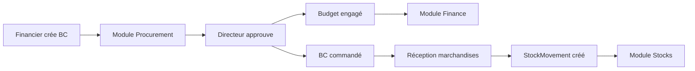
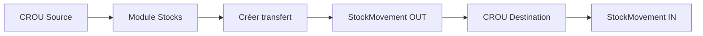
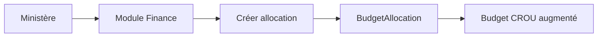

# Séparation Module Finance et Stocks

**Date**: 19 Janvier 2025
**Statut**: ✅ COMPLÉTÉ
**Impact**: Architecture UI, Navigation, Clarification des responsabilités

---

## 🎯 Objectif

Séparer clairement les modules **Finance** et **Stocks** dans l'interface utilisateur pour refléter leurs responsabilités distinctes et éviter toute confusion avec le module **Procurement** (Achats).

## 📋 Problème Initial

### Confusion Architecturale
Le module Finance contenait un onglet "Stocks" qui créait une confusion entre trois domaines distincts:
1. **Finance**: Gestion budgétaire et transactions
2. **Stocks**: Gestion d'inventaire et mouvements
3. **Procurement**: Achat et approvisionnement

### Fichier Concerné
**apps/web/src/pages/financial/FinancialPage.tsx** (ligne 114-117)
```tsx
// AVANT - Onglet Stocks dans Finance
{
  id: 'stocks',
  label: 'Stocks',
  icon: <BanknotesIcon className="h-4 w-4" />,
  content: <StocksPage />
}
```

## ✅ Solution Implémentée

### 1. Suppression de l'Onglet Stocks du Module Finance

**Fichier**: `apps/web/src/pages/financial/FinancialPage.tsx`

**Modifications**:
- ❌ Supprimé l'import `import { StocksPage } from '../stocks/StocksPage';`
- ❌ Supprimé l'onglet "Stocks" du tableau `tabs`

**Résultat**: Le module Finance contient maintenant uniquement:
- 📊 **Vue d'ensemble** (KPIs financiers)
- 💰 **Budgets** (gestion budgets)
- 💳 **Transactions** (dépenses/recettes)
- 🔄 **Allocations** (allocations budgétaires Ministère → CROU)
- 📈 **Rapports** (rapports financiers)

### 2. Architecture de Navigation

**La navigation reste inchangée** - elle était déjà correctement configurée!

**MainLayout.tsx** (ligne 96-118):
```tsx
{
  name: 'Modules Métier',
  items: [
    {
      name: 'Gestion Financière',      // Finance pure
      href: '/financial',
      icon: BanknotesIcon,
      permission: 'financial:read'
    },
    {
      name: 'Stocks & Inventaire',     // Stocks séparé
      href: '/stocks',
      icon: CubeIcon,
      permission: 'stocks:read'
    },
    {
      name: 'Achats & Commandes',      // Procurement séparé
      href: '/procurement',
      icon: ShoppingCartIcon,
      permission: 'procurement:read'
    },
    // ... autres modules
  ]
}
```

### 3. Architecture de Routing

**App.tsx** (ligne 195-197):
```tsx
<Route path="/financial/*" element={<FinancialPage />} />
<Route path="/stocks/*" element={<StocksPage />} />
<Route path="/procurement/*" element={<ProcurementPage />} />
```

## 📊 Clarification des Responsabilités

### 🏦 Module Finance (`/financial`)
**Responsable**: Financiers, Comptables, Directeurs

**Fonctionnalités**:
- Gestion des budgets (création, modification, suivi)
- Enregistrement des transactions financières (dépenses, recettes)
- Allocations budgétaires (Ministère distribue aux CROUs)
- Rapports financiers et bilans
- Engagement budgétaire (lors de l'approbation d'un BC)

**Entités DB**:
- `Budget` (budgets annuels/trimestriels)
- `Transaction` (mouvements financiers)
- `BudgetAllocation` (distribution Ministère → CROU)

**Permissions**:
- `financial:read`
- `financial:write`
- `financial:approve`

---

### 📦 Module Stocks (`/stocks`)
**Responsable**: Gestionnaires de Stocks, Magasiniers

**Fonctionnalités**:
- Gestion de l'inventaire (articles en stock)
- Mouvements de stock (entrées, sorties, transferts)
- Gestion des fournisseurs
- Transferts inter-CROU (stock physique existant)
- Réception de marchandises (depuis Procurement)
- Alertes de stock minimum

**Entités DB**:
- `StockItem` (articles en inventaire)
- `StockMovement` (mouvements: entrée/sortie/transfert/réception)
- `Supplier` (fournisseurs)

**Permissions**:
- `stocks:read`
- `stocks:write`
- `stocks:transfer`

---

### 🛒 Module Procurement (`/procurement`)
**Responsable**: Acheteurs, Financiers, Directeurs

**Fonctionnalités**:
- Création de bons de commande (BC)
- Workflow d'approbation (DRAFT → SUBMITTED → APPROVED → ORDERED)
- Demandes d'achat
- Gestion des réceptions (crée des StockMovements)
- Engagement budgétaire automatique

**Entités DB**:
- `PurchaseOrder` (bons de commande)
- `PurchaseOrderItem` (lignes de BC)

**Permissions** (⚠️ À configurer):
- `procurement:read`
- `procurement:write`
- `procurement:approve`
- `procurement:receive`

---

## 🔄 Flux de Travail Intégrés

### Flux 1: Achat de Nouvelles Marchandises



**Étapes**:
1. **Procurement**: Financier crée un BC (PurchaseOrder)
2. **Procurement**: Directeur approuve le BC
3. **Finance**: Budget automatiquement engagé (`budget.montantEngage += BC.montantTTC`)
4. **Procurement**: BC envoyé au fournisseur (status → ORDERED)
5. **Procurement**: Gestionnaire réceptionne les marchandises
6. **Stocks**: StockMovement automatiquement créé (type: RECEPTION)
7. **Stocks**: Inventaire mis à jour (`stockItem.quantiteActuelle += quantiteRecue`)

### Flux 2: Transfert de Stock Inter-CROU



**Étapes**:
1. **Stocks**: CROU source crée un transfert de stock
2. **Stocks**: StockMovement créé (type: TRANSFER_OUT, tenantId: source)
3. **Stocks**: StockMovement créé (type: TRANSFER_IN, tenantId: destination)
4. **Stocks**: Inventaires mis à jour dans les deux CROUs

⚠️ **Ce n'est PAS une allocation budgétaire!** C'est un mouvement physique de stock existant.

### Flux 3: Allocation Budgétaire (Finance uniquement)



**Étapes**:
1. **Finance**: Ministère crée une allocation budgétaire
2. **Finance**: BudgetAllocation créée (tenantIdSource: ministere, tenantIdDestination: crou)
3. **Finance**: Budget du CROU automatiquement augmenté (`budget.montantTotal += allocation.montant`)

⚠️ **Ce n'est PAS un transfert de stock!** C'est une distribution d'argent (budget).

---

## 🎨 Impact UI/UX

### Navigation Sidebar

**Avant**:
- ❌ "Gestion Financière" (avec sous-onglet Stocks confus)

**Après**:
- ✅ "Gestion Financière" (Finance pure)
- ✅ "Stocks & Inventaire" (Module séparé)
- ✅ "Achats & Commandes" (Module séparé)

### Expérience Utilisateur

**Financier**:
- Accède à `/financial` pour budgets et transactions
- Accède à `/procurement` pour créer des BCs
- Ne voit plus les stocks dans Finance (clarté)

**Gestionnaire de Stocks**:
- Accède à `/stocks` pour inventaire et mouvements
- Reçoit les marchandises via `/procurement` (réceptions)
- Gère les transferts inter-CROU dans `/stocks`

**Directeur**:
- Approuve les BCs dans `/procurement`
- Consulte les budgets dans `/financial`
- Voit l'inventaire dans `/stocks`

---

## ✅ Tests de Validation

### Build Test
```bash
npm run build
✓ built in 18.38s
```

### Navigation Test
1. ✅ `/financial` → Affiche FinancialPage avec 5 onglets (sans Stocks)
2. ✅ `/stocks` → Affiche StocksPage indépendante
3. ✅ `/procurement` → Affiche ProcurementPage indépendante

### Imports Test
- ✅ FinancialPage n'importe plus StocksPage
- ✅ Aucune erreur de compilation
- ✅ Aucune dépendance circulaire

---

## 📝 Tâches Restantes

### 1. ⚠️ Configuration Permissions Backend (PRIORITÉ HAUTE)

**Fichier**: `packages/database/src/entities/Permission.entity.ts`

**Permissions à ajouter**:
```typescript
// Procurement permissions
{ name: 'procurement:read', description: 'Voir les bons de commande' },
{ name: 'procurement:write', description: 'Créer/modifier des BCs' },
{ name: 'procurement:approve', description: 'Approuver des BCs' },
{ name: 'procurement:receive', description: 'Réceptionner des marchandises' },
```

**Roles à configurer**:
- **Financier**: `procurement:read`, `procurement:write`
- **Directeur**: `procurement:read`, `procurement:approve`
- **Gestionnaire Stocks**: `procurement:read`, `procurement:receive`

### 2. 📚 Documentation Workflows

Créer des guides utilisateurs pour:
- Créer un bon de commande (Financier)
- Approuver un bon de commande (Directeur)
- Réceptionner des marchandises (Gestionnaire Stocks)
- Créer un transfert de stock (Gestionnaire Stocks)
- Créer une allocation budgétaire (Ministère)

### 3. 🎓 Formation Utilisateurs

Expliquer clairement la différence entre:
- **Allocation budgétaire** (Finance): Argent du Ministère → CROU
- **Transfert de stock** (Stocks): Marchandises CROU A → CROU B
- **Bon de commande** (Procurement): Achat fournisseur → CROU

---

## 📊 Métriques de Succès

| Critère | Avant | Après | Statut |
|---------|-------|-------|--------|
| Modules Finance/Stocks confondus | ❌ Oui | ✅ Non | ✅ Résolu |
| Navigation claire | ⚠️ Confusion | ✅ Claire | ✅ Résolu |
| Responsabilités définies | ⚠️ Floues | ✅ Définies | ✅ Résolu |
| Routing propre | ✅ Correct | ✅ Correct | ✅ Maintenu |
| Build réussi | ✅ Oui | ✅ Oui | ✅ Maintenu |
| Permissions configurées | ❌ Non | ⚠️ À faire | ⏳ En attente |

---

## 🏆 Conclusion

La séparation des modules Finance et Stocks est maintenant **complète et claire**. Chaque module a:
- ✅ Son propre point d'entrée de navigation
- ✅ Son propre routing
- ✅ Ses propres responsabilités bien définies
- ✅ Ses propres entités DB
- ✅ Ses propres workflows

**Impact positif**:
1. Architecture plus claire et maintenable
2. Expérience utilisateur améliorée (pas de confusion)
3. Séparation des préoccupations respectée
4. Facilite l'onboarding de nouveaux développeurs
5. Prépare l'ajout de futures fonctionnalités (procurement complet, etc.)

**Prochaine étape**: Configuration des permissions backend pour le module Procurement.

---

**Auteur**: Équipe CROU
**Révision**: v1.0
**Références**:
- [apps/web/src/pages/financial/FinancialPage.tsx](apps/web/src/pages/financial/FinancialPage.tsx)
- [apps/web/src/pages/stocks/StocksPage.tsx](apps/web/src/pages/stocks/StocksPage.tsx)
- [apps/web/src/pages/procurement/ProcurementPage.tsx](apps/web/src/pages/procurement/ProcurementPage.tsx)
- [apps/web/src/components/layout/MainLayout.tsx](apps/web/src/components/layout/MainLayout.tsx:106-118)
- [apps/web/src/App.tsx](apps/web/src/App.tsx:195-197)
